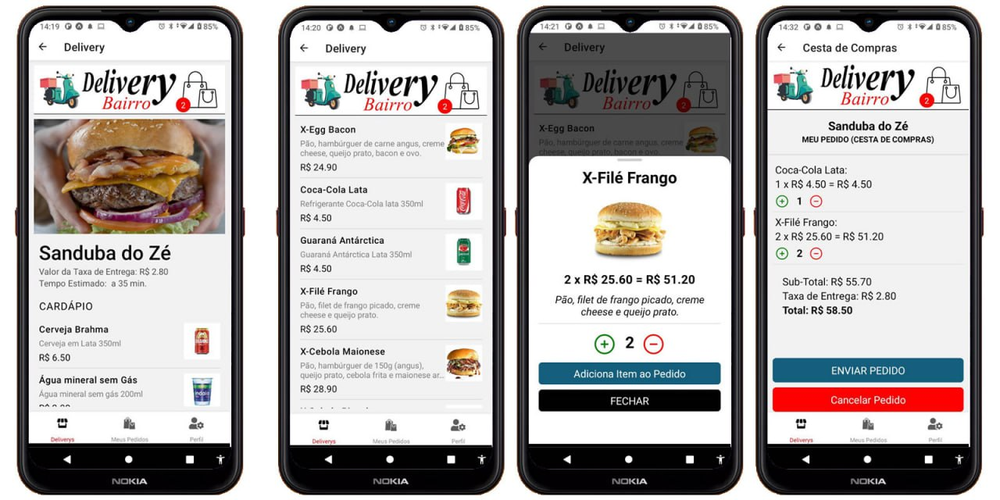

## DeliveryBairro App 
Projeto desenvolvido em React Native + Expo CLI para gestão de pedidos e entregas foco no segmento de Delivery em Geral, tais como Bares, Restaurantes, Fastfoods, Distribuidoras de Bebidas, Farmárcias, Drograrias, Mercados de Conveniência, Supermercados, Gás de Cozinha, Água Mineral, etc.

## instalação
para instalar as dependências (node_modules) e executar o App, remova antes a pasta pasta "node_nodules" e o arquivo "yarn.lock" caso existam, em seguida execute o comando <strong>yarn install</strong> na pasta raiz, instale o Expo CLI: <strong>npm install -g expo-cli</strong> e o AWS Amplify CLI: <strong>npm install -g @aws-amplify/cli</strong>, caso for necessário, instale antes o Yarn: <strong>npm install --global yarn</strong>

## Edit & Run App
conecte o celular via cabo USB c/ o modo Desenvolvedor ativado e Depuração via USB, para abrir o editor (VSCode) e executar (via Expo GO) digite no prompt de comando <strong>code . && npx expo start</strong>

## Atualizando o NodeJs/npm, Expo-CLI e EAS-CLI
https://www.npmjs.com/package/npm-windows-upgrade

npm install -g expo-cli
npm install -g eas-cli

## deployment
<strong>eas build -p android --profile preview</strong>

## Using FCM for Push Notifications
See at https://docs.expo.dev/push-notifications/using-fcm/
Finally, make a new build of your app by <strong>running eas build --platform android</strong> (or <strong>expo build:android<strong> if you're using the classic build system).

## Link para baixar o APK DeliveryBairro v1.0 (MVP) Build #1 (27/10/2022 12:07)
https://expo.dev/artifacts/eas/fByfzoZUQava4UaUjLChQa.apk

## Some parts of the source code written with the aid of the artificial intelligence of OpenAI's ChatGPT
https://openai.com/blog/chatgpt/

## Contato

telefone: (31) 98410-7540 WhatsApp

email: ezequiasmartins@gmail.com

by <a href="https://ezequiasmartins.blogspot.com/" target="_blank">Ezequias Martins</a> ® 1999-2022 Direitos Reservados

